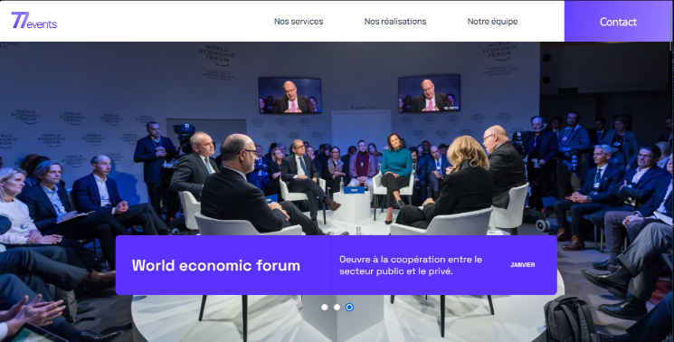

# 724events - Agence événementielle

* Ce travail a été réalisé dans le cadre du projet n°9 de la formation Intégrateur Web d'OpenClassrooms.

* Ce projet consiste en la finalisation et le débogage du site vitrine d'une agence événementielle nommée 724events.

* L'objectif du site est de présenter les services et réalisations de l'agence tout en garantissant :

    * une correction complète des bugs fonctionnels (Slider, formulaires, filtres),
    * une exécution conforme des tests unitaires et d'intégration,
    * un déploiement fonctionnel sur GitHub Pages.

## Fonctionnalités

* **Affichage dynamique** : Présentation des prestations et des événements via un Slider et une liste filtrable.

* **Débogage technique** : Correction de la logique de tri des événements, de la sélection du dernier événement et de la navigation du Slider.

* **Tests automatisés** : Mise en place et validation de tests pour assurer la stabilité des composants (DataContext, Formulaire).

* **Contact** : Formulaire permettant aux visiteurs de solliciter l'agence avec affichage d'un message de confirmation après envoi.

## Outils et langages pour la réalisation du projet

* Le projet a été réalisé avec **HTML5, CSS3 (Sass), JavaScript et React**.

* La gestion des données globales est assurée par l'API Context de React.

* Les tests unitaires et d'intégration ont été effectués via **Jest** et **React Testing Library**.
